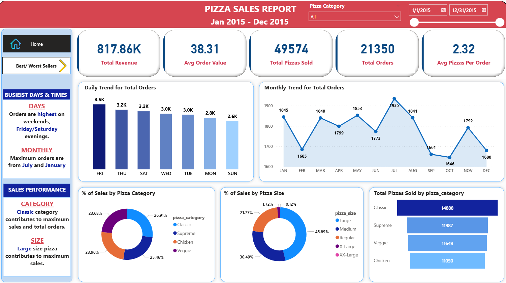
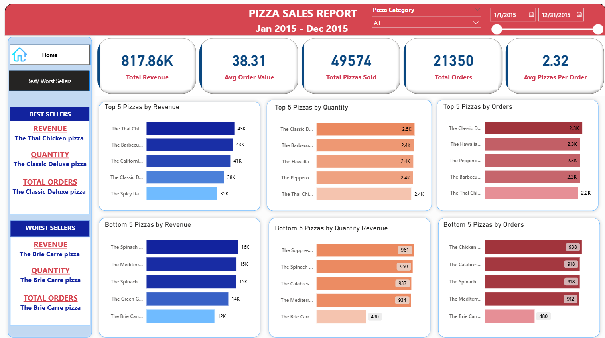

# Pizza Sales Analysis (SQL + Power BI)

Power BI dashboard + SQL analysis for a pizza sales dataset (Jan 2015 – Dec 2015).  
This project highlights key business KPIs, demand patterns (day/month), category & size performance, and best/worst sellers.

---

## What’s in this repo
- **Pizza Sales Dashboard.pbix** — Interactive Power BI report (2 pages)
- **PIZZA SALES SQL QUERIES.docx** — SQL queries used to compute KPIs and insights
- **images/** — Dashboard screenshots for quick viewing on GitHub

---

## Dashboard preview

### Page 1 — KPI summary + Best/Worst sellers

### Page 2 — Trends + Category/Size performance

---

## Key KPIs (Jan–Dec 2015)
From the Power BI dashboard:
- **Total Revenue:** 817.86K  
- **Total Orders:** 21,350  
- **Total Pizzas Sold:** 49,574  
- **Avg Order Value:** 38.31  
- **Avg Pizzas per Order:** 2.32  

---

## Findings & insights

### Demand patterns
- **Busiest days:** Orders peak on **Friday**, followed by **Thursday/Saturday** (weekends + Friday/Saturday evenings perform best).
- **Monthly peak:** **July** shows the highest monthly orders, with **January** also strong.

### Product performance
- **Top pizza category (by volume):** **Classic** (highest pizzas sold)
- **Top size (by sales share):** **Large** size dominates

### Best / worst sellers (high level)
- **Best seller by revenue:** *The Thai Chicken Pizza*
- **Best seller by quantity & total orders:** *The Classic Deluxe Pizza*
- **Worst seller overall:** *The Brie Carre Pizza* (lowest revenue, quantity, and orders)

---

## SQL analysis (what the queries cover)
The SQL script document includes queries for:
- **KPIs:** total revenue, average order value, total pizzas sold, total orders, avg pizzas/order
- **Trends:** daily trend (orders by weekday), monthly trend (orders by month)
- **Mix analysis:** % of sales by pizza category, % of sales by pizza size
- **Volume:** total pizzas sold by category
- **Rankings:** top/bottom 5 pizzas by revenue, quantity, and total orders  
- Optional filtering examples using `WHERE` (e.g., filter by category/size)

---

## How to use
1. **Open the dashboard:** Download `Pizza Sales Dashboard.pbix` and open in **Power BI Desktop**
2. Use slicers to filter:
   - **Pizza Category**
   - **Date range (Jan–Dec 2015)**
3. Review/replicate metrics using the SQL queries in `PIZZA SALES SQL QUERIES.docx`

---

## Notes
- GitHub can’t render `.pbix` files directly — download and open locally in Power BI Desktop to interact with the report.
